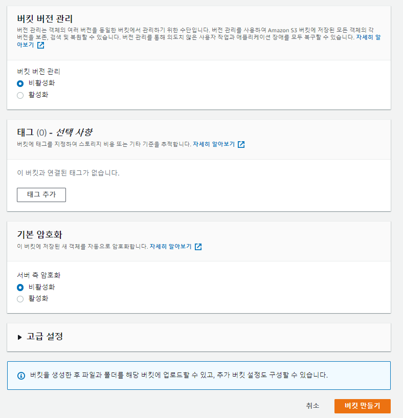
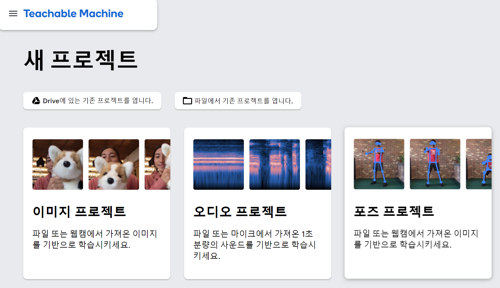
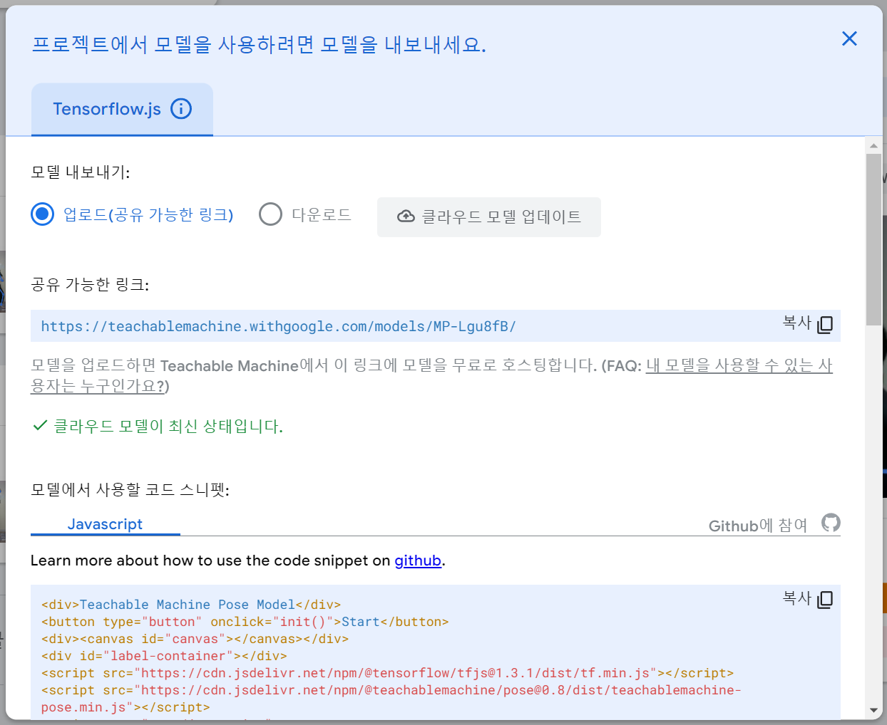

# 프로젝트에서 사용하는 외부 서비스 정보 문서

<br>

## 파일서버 - Amazon EC2

> Amazon EC2는 AWS(Amazon Web Services) 클라우드에서 확장 가능한 컴퓨팅 용량을 제공합니다. Amazon EC2를 사용하면 하드웨어에 대한 투자를 앞당길 필요가 없기 때문에 애플리케이션을 신속하게 개발하고 배포할 수 있습니다.
>
> 이를 통해 AWS의 환경을 컴퓨팅에 사용하고 컴퓨팅 리소스를 완전히 제어 할 수 있습니다. 컴퓨팅 요구가 변화함에 따라 Amazon EC2를 통해 몇 분 안에 새로운 서버 인스턴스를 가져오고 부팅 할 수 있으므로 용량을 빠르게 확장 할 수 있습니다. 또한 일반적인 실패 시나리오를 방지하고 개발자가 장애 복구 능력이 뛰어난 모바일 응용 프로그램을 개발할 수 있는 도구를 제공합니다.

> 

<br>

## Amazon EC2 인스턴스 생성하기

<br>

1. [AWS 홈페이지](https://aws.amazon.com/) 접속 후 로그인

   <br>

2. 메인화면 오른쪽 상단에 서비스를 누른 후, 컴퓨팅 메뉴에서 EC2를 선택

   

   <br>

3. 인스턴스 생성 클릭

   

   <br>

4. Ubuntu AMI 선택 버튼 클릭


<br>

5. 보안 그룹 구성 누른 후, 규칙 추가 버튼 클릭

> 저희는 파일 서버로 사용하려면 퍼블릭 액세스가 허용이 돼야한다고 판단하여 퍼블릭 액세스 차단 기능을 활성화 하지 않았습니다!


<br>

6. 선택한 옵션 확인 후, 검토 및 시작 버튼 클릭


<br>

7. 새 키 페어 생성 선택 하여 키 페어를 입력 입력 후, 키 페어 다운로드 버튼을 눌러 컴퓨터에 키 페어를 보관

   <br>

## Amazon EC2 접속하기

<br>

1. [Mobaxterm 홈페이지](https://mobaxterm.mobatek.net/) 접속 후 설치

   

   <br>

2. Session 클릭

   <br> 

   <br>

3. Remote host에는 부여 받은 접속 주소를 기입하고, 아래의 Advanced SSH settings 탭에서 use private key를 체크한 다음 부여 받은 pem키를 업로드 후 OK버튼 클릭


   <br>

4. `login as:` 프롬포트가 뜨면 `ubuntu`라 입력 후 엔터를 치면 접속 성공

   

   <br>

<br>

## Amazon S3

> Amazon Simple Storage Service(Amazon S3)는 업계 최고의 확장성과 데이터 가용성 및 보안과 성능을 제공하는 객체 스토리지 서비스입니다. Amazon S3는 사용하기 쉬운 관리 기능을 제공하므로 특정 비즈니스, 조직 및 규정 준수 요구 사항에 따라 데이터를 조직화하고 세부적인 액세스 제어를 구성할 수 있습니다. Amazon S3는 99.999999999%의 내구성을 제공하도록 설계되었으며, 전 세계 기업의 수백만 애플리케이션을 위한 데이터를 저장합니다.

> 

<br><br>

### Amazon S3의 장점

1. 일반적인 파일 서버는 사용자 트래픽이 증가하면 스토리지 증설 작업을 해야하지만 S3는 시스템적으로 트래픽 증가에 대한 처리를 미리 해두었기 때문에 파일 서버 관리자는 별도의 처리를 해주지 않아도 됩니다.
2. 저장할 수 있는 파일 수의 제한이 없습니다.
3. 버킷마다 인증 시스템을 설정할 수 있어 보안이 좋습니다.
4. HTTP와 BitTorrent 프로토콜을 지원합니다.
5. REST, SOAP(HTTPS만 가능) 인터페이스를 제공합니다.
6. 버전관리 기능을 사용하면 사용자가 실수할 경우에도 복원이 가능합니다.

<br><br>

### Amszon S3 용어 설명

- bucket
  - S3에서 생성되는 최상위 디렉토리이며 디렉터리와 객체를 저장하는 컨테이너입니다. 버킷의 이름은 S3에서 유일해야 하며, 버킷 단위로 region을 지정할 수 있고, 버킷 별로 접근 제어 설정을 할 수 있습니다.
- Object
  - S3에 저장되는 데이터를 객체라고 하며, 파일과 메타데이터로 이루어져 있습니다.
  - 객체의 크기는 최대 5TB 까지 허용됩니다.
- Key
  - 버킷 내에서 객체를 찾기 위해 사용되는 고유 식별자입니다.
  - 보통 "디렉터리 + 파일명"으로 명명됩니다.
- Region
  - 버킷 생성 시 버킷의 위치를 지정할 수 있습니다. 버킷 위치를 어디에 지정하냐에 따라서 지연 시간 최적화, 비용 최소화 등이 결정됩니다.

<br><br>

### 설정

1. 버킷 만들기
   

2. 버킷 이름과 리전 선택
   

- 버킷 이름은 고유해야 하며, 리전은 서비스 지역에 따라서 설정

3. 퍼블릭 액세스 설정
   

- 외부에 S3를 공개할 경우 모든 퍼블릭 액세스 차단 체크를 해제
- 외부에 공개하지 않고 내부에서만 사용하려면 모든 퍼블릭 액세스 차단을 체크
- 퍼블릭 액세스가 차단되었을 경우 IAM에서 AWSAccessKeyId와 AWSSecretKey를 발급받고 이를 이용해 S3 객체에 접근

4. 버킷 버전 관리 및 기본 암호화
   

- **버킷 버전 관리기능**을 활성화하면 파일을 버전별로 관리하기 때문에 비용이 더 들지만 사용자가 실수로 파일을 삭제해도 복원 가능
- **기본 암호화**를 활성화하면 버킷에 저장되는 모든 새 객체를 암호화, 객체를 다운로드할 때 암호를 해독화

5. 퍼블릭 정책 활성화
   

- Select Type of Policy: S3 Bucket Policy
- Effect: Allow
- Principal: \*
- AWS Service: Amazon S3
- Actions: 원하는 권한 선택
- Amazon Resource Name(ARN): arr:aws:s3:::bucket-name/\*

6. 액세스 키 생성
   

- IAM > 액세스 키 > 새 액세스 키 만들기
- 액세스 키는 AWSAccessKeyId와 AWSSecretKey로 구성
- AWSAccessKeyId와 AWSSecretKey는 절대 외부에 노출되어서는 안됨.

<br>

# 운동인식 Teachable Machine

> Teachable Machine은 누구나 머신러닝 모델을 쉽고 빠르고 간단하게 만들 수 있도록 제작된 웹 기반 API입니다. 특정 동작, 영상, 이미지 등을 학습시켜 이를 모델로 추출하여 클라우드에 업로드하면, 코드내에서 import하여 사용이 가능합니다.

## 빠른 시작

1. [Teachable Machine](https://teachablemachine.withgoogle.com/) 사이트에 접속합니다



2. 포즈 프로젝트를 사용하였습니다
3. 운동을 `운동자세`와 `대기자세`로 나누어 샘플을 촬영합니다


4. 모델 학습하기 버튼을 통해, 촬영한 샘플들로 `자세인식 모델`을 만들 수 있습니다 

   > 만든 모델은 `자세`만 인식하며, 후술할 과정들을 통해 운동인식으로 만들어주어야 합니다

   

5. 만들어진 모델은 업로드하여 링크(URL)을 통해 사용하거나, 다운받아 로컬에서도 사용할 수 있습니다

   > `클라우드 모델 업데이트`자리에 위치한 `모델 업로드`를 클릭하면, 공유가능한 링크로 작동하는 모델의 HTML, JavaScript코드가 생성됩니다



6. `모델이 자세를 인식하는 값`을 조작하여 `운동중`상태와 `횟수`를 카운트합니다

   > 아래는 제공되는 코드 스니펫에 운동인식기능을 추가한 코드입니다

   > ```javascript
   > var status = "wait"
   > var count = 0
   > 
   > async function predict() {
   >   const { pose, posenetOutput } = await model.estimatePose(webcam.canvas);
   >   const prediction = await model.predict(posenetOutput);
   >     if (prediction[0].probability.toFixed(2) > 0.80) {
   >       if (status == "action") {
   >         count++
   >         status = "wait"
   >     } else if (prediction[1].probability.toFixed(2) > 0.80) {
   >         status = "action"
   > }
   > ```
   >
   > Teachable Machine 웹사이트에서 학습시킨 자세 순서대로
   >
   > prediction은 자세가 들어있는 배열이며
   >
   > prediction[i].probability는 자세를 인식하여 정확도를 계산한 값입니다
   >
   > probability 값은 0.00 ~ 1.00까지 소수로 표현되며 일치할 수록 1.00에 가까운 값을 반환합니다

   **운동상태를 인식하는 알고리즘은 아래와 같이 작동합니다**

   > 처음에 대기자세에서 시작하여, action자세와 80%정도 유사할 경우 `운동중`으로 확인합니다
   >
   > `운동중`상태에서 다시 대기자세로 돌아올 경우, 횟수를 카운트하고 다시 대기자세로 저장합니다
