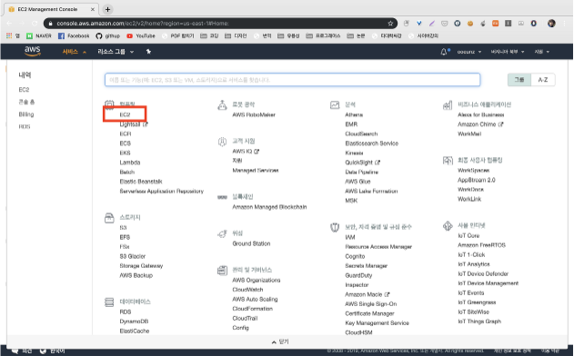

# 프로젝트에서 사용하는 외부 서비스 정보 문서

 

## 파일서버 - Amazon EC2

> Amazon EC2는 AWS(Amazon Web Services) 클라우드에서 확장 가능한 컴퓨팅 용량을 제공합니다. Amazon EC2를 사용하면 하드웨어에 대한 투자를 앞당길 필요가 없기 때문에 애플리케이션을 신속하게 개발하고 배포할 수 있습니다.
>
> 이를 통해 AWS의 환경을 컴퓨팅에 사용하고 컴퓨팅 리소스를 완전히 제어 할 수 있습니다. 컴퓨팅 요구가 변화함에 따라 Amazon EC2를 통해 몇 분 안에 새로운 서버 인스턴스를 가져오고 부팅 할 수 있으므로 용량을 빠르게 확장 할 수 있습니다. 또한 일반적인 실패 시나리오를 방지하고 개발자가 장애 복구 능력이 뛰어난 모바일 응용 프로그램을 개발할 수 있는 도구를 제공합니다.

> 

 

## Amazon EC2 인스턴스 생성하기

 

1. [AWS 홈페이지](https://aws.amazon.com/) 접속 후 로그인

    

2. 메인화면 오른쪽 상단에 서비스를 누른 후, 컴퓨팅 메뉴에서 EC2를 선택

     

    

3. 인스턴스 생성 클릭

     

    

4. Ubuntu AMI 선택 버튼 클릭

  

 

5. 보안 그룹 구성 누른 후, 규칙 추가 버튼 클릭

> 저희는 파일 서버로 사용하려면 퍼블릭 액세스가 허용이 돼야한다고 판단하여 퍼블릭 액세스 차단 기능을 활성화 하지 않았습니다!

  

 

6. 선택한 옵션 확인 후, 검토 및 시작 버튼 클릭

  
 

7. 새 키 페어 생성 선택 하여 키 페어를 입력 입력 후, 키 페어 다운로드 버튼을 눌러 컴퓨터에 키 페어를 보관

      

## Amazon EC2 접속하기

 

1. [Mobaxterm 홈페이지](https://mobaxterm.mobatek.net/) 접속 후 설치

     

    

2. Session 클릭

      

    

3. Remote host에는 부여 받은 접속 주소를 기입하고, 아래의 Advanced SSH settings 탭에서 use private key를 체크한 다음 부여 받은 pem키를 업로드 후 OK버튼 클릭

  

    

4. `login as:` 프롬포트가 뜨면 `ubuntu`라 입력 후 엔터를 치면 접속 성공

   

    
