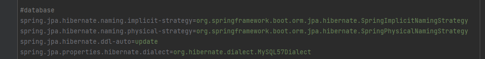
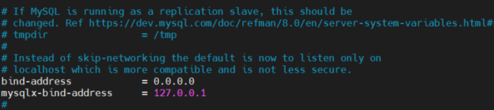

# 프로젝트 빌드 및 배포


## ⚙ 시스템 환경 및 구성

- OS: Windows10
- Backend Framework: Spring Boot 2.4.5
- Frontend Framework: React
- DB: mysql Ver 8.0.27 for Win64 on x86_64 (MySQL Community Server - GPL)
- WAS: Gradle
- JVM: openJDK (1.8.0_192)
- Node.js: 16.14
- Docker: 20.10.12
- WEB: Nginx (1.18.0)

<br/>

## 🎪DB 접속 정보 및 프로퍼티


###  Database 접근

> ID: ssafy
>
> PW: ssafy1234


<h3> Database 프로퍼티

</h3>

application.yml 



엔티티의 변경분만 DB에 반영


database url, driver-class-name, username, password 및 기타 정보를 읽어들임


### 👨‍👩‍👧‍👧 협업 툴

------

- Git

- Jira

- Notion

- Discord

- Mattermost

- Webex

  

## **2. 배포 순서**

##### **Ubuntu에 도커 설치**

```
sudo apt-get update
```

```
# 필수 패키지 설치
$ sudo apt-get install \
       apt-transport-https \
       ca-certificates \
       curl \
       gnupg \
       lsb-release
```

```
# GPG Key 인증
$ curl -fsSL https://download.docker.com/linux/ubuntu/gpg | sudo apt-key add -
```

```
# docker repository 등록
$ sudo add-apt-repository "deb [arch=amd64] https://download.docker.com/linux/ubuntu $ (lsb_release -cs) stable"
```

```
# 도커 설치
$ sudo apt-get update
$ sudo apt-get install docker-ce docker-ce-cli containerd.io

# 도커 확인
sudo service docker status
```

****

#### 도커 명령어

- 도커 컨테이너 보는 법
  - sudo docker ps -a
- 도커 컨테이너 삭제
  - sudo docker rm <container_id>
- 도커 이미지 보는 법
  - sudo docker images
- 도커 이미지 삭제
  - sudo docker rmi <image_id>
- 강제 옵션 -f (삭제가 안될 때,)
  - ex) docker rmi -f <image_id>
- 도커 로그 확인
  - docker logs <image_id> : 도커가 꺼져있어도(컨테이너가) 최종적으로 실행된 기록을 가지고 있습니다(오류 잡을 때, 매우 유용)

##### **docker 네트워크 설정**

같은 Docker Host내에서 실행중인 Container간 연결할 수 있도록 돕는 논리적 **네트워크**같은 개념입니다. 서로 간 통신을 가능하게 합니다. nginx를 통한 front, backend 통신을 위해 설정합니다.

```
sudo docker network create thxstorecicdnetwork
```


### (1). 현재 방화벽 설정 확인

```bash
1. sudo ufw status 
```

#####  **# ufw가 inactive으로 되어 있다면 SSH 포트를 통한 접속 허용 후 방화벽 설정하기  ( 꼭 이 순서로 할 것 )** 

```
1. sudo ufw allow 22 
2. sudo ufw enable
```


### (2). EC2에 MySQL 설치 및 세팅

```
# 다음 명령어들을 쳐서 MySQL을 설치한다.
sudo apt-get update
sudo apt-get install mysql-server
```

```
# MySQL 구동을 한다.
sudo systemctl start mysql.service
```

```
# 여기서 보안을 더 높이고 싶다면 보안 위험이 있는 디폴트 값들의 설정을 변경할 수 있는
# mysql_secure_installation 스크립트를 실행한다.
sudo docker exec -it ssafydb bash
```

```
# MySQL 접속
$ sudo mysql
● 아래의 쿼리를 쳐보면 현재 mysql에서 기본으로 세팅 되어있는 유저 들만 있는 것을 볼 수 있다.
  mysql > SELECT user,authentication_string,plugin,host FROM mysql.user;
```


**● 우리가 사용할 새로운 유저를 만들기 위해 아래와 같이 새로운 계정을 생성하고 GRANT 쿼리로 필요한 권한들을 부여한다.**

**● 아래 쿼리는 새로운 계정에 모든 권한을 부여해준다. % 는 어떠한 ip로도 접속이 가능하다는 뜻이다.**

**● 유저 추가 후 다시 위의 쿼리를 쳐보면 유저가 추가된 것을 확인할 수 있다.**

```
mysql> CREATE USER '계정이름'@'%' IDENTIFIED BY '비밀번호';
mysql> GRANT ALL PRIVILEGES ON . TO '계정이름'@'%' WITH GRANT OPTION;
mysql> FLUSH PRIVILEGES;
```


### (3). MySQL Workbench 설치해서 EC2에 있는 DB와 연결하기

```
효율적인 협업을 위해 로컬에 Workbench를 설치해서 EC2와 연동한다. 
이렇게 하면 모든 팀원이 개발은 로컬로 하면서도 DB를 공유할 수 있어 편리하다.
```

 **외부 접속을 허용하기 위한 설정을 한다.   EC2 서버에서 /etc/mysql/mysql.conf.d 로 이동해서 vi mysqld.cnf 를 실행해준다.**

```
 외부 접속을 허용하기 위한 설정을 한다.
 EC2 서버에서 /etc/mysql/mysql.conf.d 로 이동해서 vi mysqld.cnf 를 실행해준다.
```

**vi 에디터에서 i 를 눌러 bind-address 를 0.0.0.0 으로 수정해준 후 저장하고 나간다.**



● **방화벽에서 MySQL이 사용하게 될 3306 포트를 열어준다.**

```
# 방화벽 설정 (포트 3306 오픈)
$ sudo ufw allow 3306
```

● MySQL을 재시작해준다.

```
$ sudo systemctl restart mysql.service
```

 ● MySQL Workbench를 **로컬에 설치**해준다.  

  설치가 끝나면 실행해서 새로운 connection을 추가해 준다. 

 ●  Connection Name 에는 원하는 커넥션명을, Hostname 에는 접속할 주소를,   

​     Username 에는 아까 생성한 MySQL 계정의 유저네임을 입력하고 OK를 누른다.

 ● 접속 시 아까 생성한 유저의 비밀번호를 입력하면 연결이 되어    workbench에서 EC2에 올린 DB를 접근할 수 있게 된다.


### **(4). HTTPS 키 발급**

frontend에서는 ssl이 적용되어 있기 때문에 HTTPS 인증을 받아야합니다.

```
# letsencrypt 설치하기
sudo apt-get update
sudo apt-get install letsencrypt

# 만약 nginx를 사용중이면 중지
sudo systemctl stop nginx

# 인증서 발급
# sudo letsencrypt certonly --standalone -d 도메인[i6팀ID.p.ssafy.io]
sudo letsencrypt certonly --standalone -d i6e103.p.ssafy.io
# 자신의 이메일 쓰고 Agree
# 뉴스레터 no
# 키가 발급되는데 이 두 가지를 써야합니다. 밑의 경로에 각각 하나씩 있습니다.
 ssl_certificate /etc/letsencrypt/live/도메인이름/fullchain.pem; 
 ssl_certificate_key /etc/letsencrypt/live/도메인이름/privkey.pem; 
 
# 인증서 위치 폴더 이동
cd /etc/letsencrypt/live/도메인

# pem을 PKCS12 형식으로 변경
openssl pkcs12 -export -in fullchain.pem -inkey privkey.pem -out keystore.p12 -name airpageserver -CAfile chain.pem -caname root

# 인증서 복사
# 인증서 보관 폴더를 미리 생성해 주세요.
# sudo cp [파일이름] [인증서를 보관 할 docker volume 폴더] 
# 아래는 예시

sudo cp fullchain.pem /home/ubuntu/docker-volume/ssl
sudo cp privkey.pem /home/ubuntu/docker-volume/ssl
sudo cp keystore.p12 /home/ubuntu/docker-volume/ssl

```


프로젝트는 docker-compose 를 사용해 빌드이미지를 만들고 **컨테이너로 배포하는 방식**을 사용했습니다.


### (5). 빌드 및 배포

> 프로젝트의 **root 경로에 있는 docker-compose를** `docker-compose up` 명령어로 실행해 프론트엔드와 백엔드 빌드 및 배포를 진행합니다.

#### docker-compose.yml

```
version: '3.2'

services:
  frontend:
    image: frontend
    build:
      context: front/
      dockerfile: Dockerfile
    ports:
      - "80:80"
      - "443:443"
    # [인증서 파일 저장 경로]:/var/www/html
    volumes:
      - /home/ubuntu/docker-volume:/var/www/html
    container_name: "frontend"
    networks:
      - helf

  backend:
    image: backend-spring
    build:
      context: back/
      dockerfile: Dockerfile
    ports:
      - "8443:8443"
      # [인증서 파일 저장 경로]:/root
    volumes:
      - /home/ubuntu/docker-volume:/root
    container_name: "backend"
    networks:
      - helf

networks:
  helf:

```


# 🗃 포트 번호

```
FrontEnd: 80
BackEnd: 8443
Jenkins: 9090
Database: 3306
```


## 프론트엔드 Dockerfile

> 빌드용 이미지와 배포용 이미지를 분리해 이미지 크기를 줄였습니다.

### dockerfile

```
FROM node:16 as build-stage
WORKDIR /app
ADD . .
RUN npm install
RUN npm run build

FROM nginx:stable-alpine as production-stage
#컨테이너 안에 nginx.conf를 옆 해당겨로에 옮겨준다.
COPY  ./nginx/nginx.conf /etc/nginx/conf.d/default.conf 

COPY --from=build-stage /app/build /usr/share/nginx/html
CMD ["nginx", "-g", "daemon off;"]# front/nginx/nginx.conf

server {
  listen 80;
  listen [::]:80;

	# server_name 도메인;
  server_name j6e102.p.ssafy.io;

  access_log /var/log/nginx/access.log;
  error_log /var/log/nginx/error.log;

  location / {
    alias /usr/share/nginx/html;
    try_files $uri $uri/ /index.html;
    return 301 https://$server_name$request_uri; # http 접속 시 https 로 자동 접속
  }
}

server {
	listen 443 ssl;
	listen [::]:443 ssl;

	# server_name 도메인;
	server_name  j6e102.p.ssafy.io;

	ssl_certificate /var/www/html/fullchain.pem;
	ssl_certificate_key /var/www/html/privkey.pem;

	root /usr/share/nginx/html;
	index index.html;

	location / {
		try_files $uri $uri/ /index.html;
	}

	location /api {
	    proxy_pass https://j6e102.p.ssafy.io:8443/api;
	}
}

```


## 백엔드 Dockerfile

> 빌드된 파일을 실행하는데에는 JRE만 필요해, 배포 이미지는 JRE를 사용했습니다.

### dockerfile

```
FROM openjdk:8-jdk-alpine
ARG JAR_FILE=build/libs/*.jar
COPY ${JAR_FILE} app.jar
EXPOSE 8080
ENV TZ=Asia/Seoul
ENTRYPOINT ["java","-jar","/app.jar"]
```


# 🧩Nginx

> frontend 디렉터리 안 nginx/nginx.conf 파일을 수정했습니다. 배포된 프론트와 백엔드 이미지는 리버스 프록시로 연결되도록 하고, let'sencrypt와 certbot을 사용해 https를 적용해 주었습니다.

### nginx config file(/etc/nginx/conf.d/default.conf)

```
# front/nginx/nginx.conf

server {
  listen 80;
  listen [::]:80;

  # server_name 도메인;
  server_name j6e102.p.ssafy.io;

  access_log /var/log/nginx/access.log;
  error_log /var/log/nginx/error.log;

  location / {
    alias /usr/share/nginx/html;
    try_files $uri $uri/ /index.html;
    return 301 https://$server_name$request_uri; # http 접속 시 https 로 자동 접속
  }
}

server {
	listen 443 ssl;
	listen [::]:443 ssl;

	# server_name 도메인;
	server_name  j6e102.p.ssafy.io;

	ssl_certificate /var/www/html/fullchain.pem;
	ssl_certificate_key /var/www/html/privkey.pem;

	root /usr/share/nginx/html;
	index index.html;

	location / {
		try_files $uri $uri/ /index.html;
	}

	location /api {
	    proxy_pass https://j6e102.p.ssafy.io:8443/api;
	}
}

```
